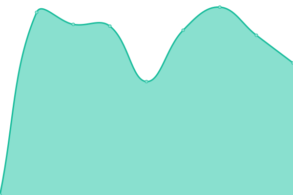
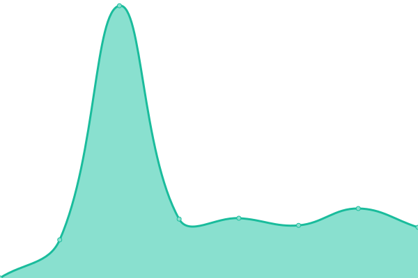

# [📈 Live Status](https://upptime.github.io/upptime): <!--live status--> **🟧 Partial outage**

This repository contains the open-source uptime monitor and status page for [Upptime](https://upptime.js.org), powered by [Upptime](https://github.com/upptime/upptime).

With [Upptime](https://upptime.js.org), you can get your own unlimited and free uptime monitor and status page, powered entirely by a GitHub repository. We use [Issues](https://github.com/upptime/upptime/issues) as incident reports, [Actions](https://github.com/muse-amuse/status/actions) as uptime monitors, and [Pages](https://upptime.github.io/upptime) for the status page.

<!--start: status pages-->
<!-- This summary is generated by Upptime (https://github.com/upptime/upptime) -->
<!-- Do not edit this manually, your changes will be overwritten -->
<!-- prettier-ignore -->
| URL | Status | History | Response Time | Uptime |
| --- | ------ | ------- | ------------- | ------ |
|  [Noetic Nought](https://punchagan.muse-amuse.in) | 🟥 Down | [noetic-nought.yml](https://github.com/muse-amuse/status/commits/HEAD/history/noetic-nought.yml) | 

 894ms
     
 | 

<a href="https://status.muse-amuse.in/history/noetic-nought">91.92%</a>
    

|  [Baali सतत](https://baali.muse-amuse.in) | 🟥 Down | [baali.yml](https://github.com/muse-amuse/status/commits/HEAD/history/baali.yml) | 

 656ms
     
 | 

<a href="https://status.muse-amuse.in/history/baali">91.92%</a>
    

|  [muse-amuse.in home page](https://muse-amuse.in) | 🟥 Down | [muse-amuse-in-home-page.yml](https://github.com/muse-amuse/status/commits/HEAD/history/muse-amuse-in-home-page.yml) | 

 381ms
     
 | 

<a href="https://status.muse-amuse.in/history/muse-amuse-in-home-page">91.92%</a>
    

|  [TIKS RSVP app](https://rsvp.tiks-ultimate.in/) | 🟩 Up | [tiks-rsvp-app.yml](https://github.com/muse-amuse/status/commits/HEAD/history/tiks-rsvp-app.yml) | 

 915ms
     
 | 

<a href="https://status.muse-amuse.in/history/tiks-rsvp-app">99.85%</a>
    

|  [KD Home](http://kadambarid.in) | 🟥 Down | [kd-home.yml](https://github.com/muse-amuse/status/commits/HEAD/history/kd-home.yml) | 

 1049ms
     
 | 

<a href="https://status.muse-amuse.in/history/kd-home">91.92%</a>
    

|  [Unframed](https://unframed.in) | 🟥 Down | [unframed.yml](https://github.com/muse-amuse/status/commits/HEAD/history/unframed.yml) | 

 488ms
     
 | 

<a href="https://status.muse-amuse.in/history/unframed">91.92%</a>
    

<!--end: status pages-->

[**Visit our status website →**](https://upptime.github.io/upptime)

## 📄 License

- Powered by: [Upptime](https://github.com/upptime/upptime)
- Code: [MIT](./LICENSE) © [Upptime](https://upptime.js.org)
- Data in the `./history` directory: [Open Database License](https://opendatacommons.org/licenses/odbl/1-0/)
